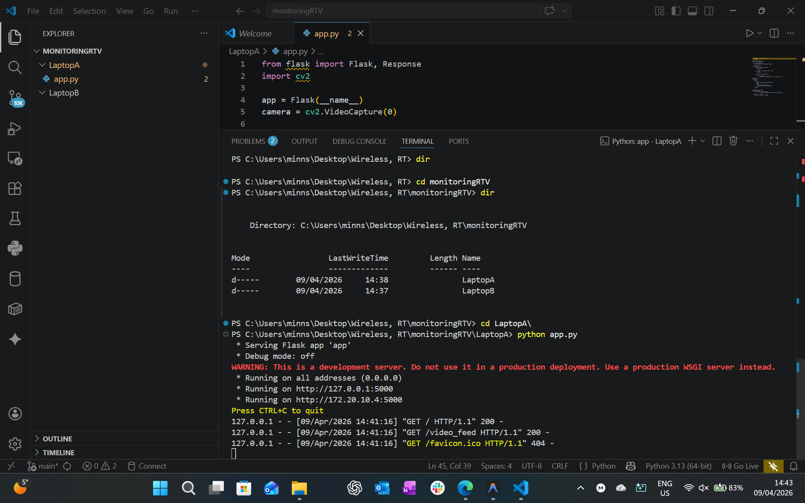
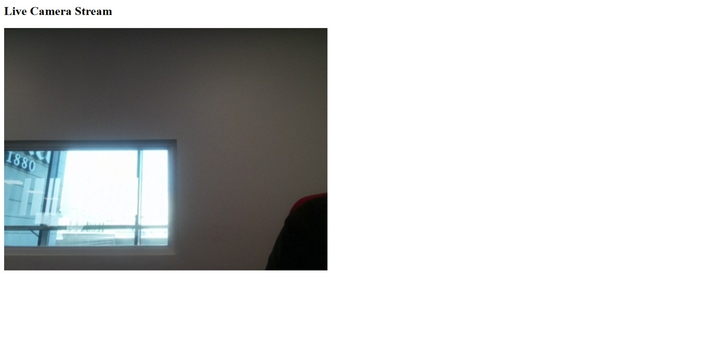

# IoT Home Monitoring System

This repository contains the code and documentation for a simple real-time home monitoring system built using Python, OpenCV, and Flask.

## Lab Setup & Roles

* **Sender (Camera Node):** Local Machine
* **Viewer (Receiver Node):** Local Machine
* **Sender IP Address:** `127.0.0.1` (Localhost)

*Note: For this implementation, both the sender and the viewer were run on the same computer locally rather than across two separate laptops.*

## How the Stream Was Started

1.  **Prerequisites:** Python 3 was installed along with the required libraries (`opencv-python` and `flask`).
2.  **Starting the Server:** The stream was initiated by opening the Command Prompt in the project directory (`iot_stream_lab`) and running the following command:
    ```bash
    python app.py
    ```
    This started the Flask server and activated the webcam.
3.  **Accessing the Stream:** The viewer accessed the stream by opening a web browser and navigating to the local address:
    ```text
    [http://127.0.0.1:5000](http://127.0.0.1:5000)
    ```

## Results

The viewer was able to successfully watch the live stream. The web browser connected to the local Flask server, and the live webcam video was displayed and updated continuously in real-time.

## Problems and Fixes

* **Problem:** The original lab instructions required two separate laptops connected to the same WiFi network, which was not feasible for this test run.
* **Fix:** The architecture was adapted to run entirely on a single machine. By utilizing the loopback address (`127.0.0.1` / `localhost`), the system successfully simulated the Camera → Capture → Encode → Stream → Viewer pipeline locally without needing a secondary device or relying on external network conditions. 

## Proof of Execution

### 1. Flask Server Running on Sender


### 2. Browser Stream Open on Viewer

